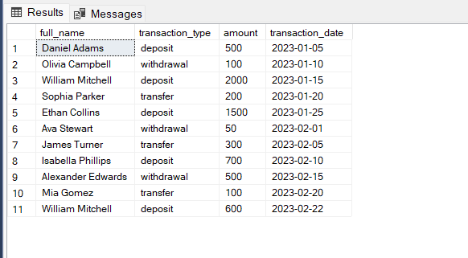
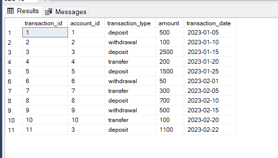
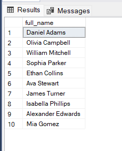
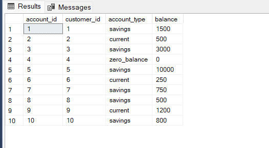
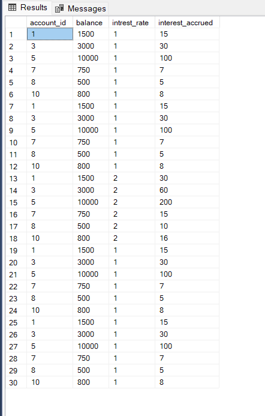
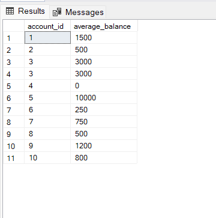
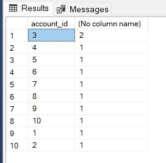
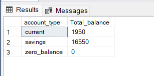

**Questions:**

1. Insert at least 10 sample records into each of the following tables: `Customers`, `Accounts`, `Transactions`, `InterestRates`, `Branches`.
2. Write a SQL query to retrieve the name, account type, and email of all customers.
3. Write a SQL query to list all transactions along with the corresponding customer.
4. Write a SQL query to increase the balance of a specific account by a certain amount.
5. Write a SQL query to combine the first and last names of customers as `full_name`.
6. Write a SQL query to remove accounts with a balance of zero where the account type is savings.
7. Write a SQL query to find customers living in a specific city.
8. Write a SQL query to get the account balance for a specific account.
9. Write a SQL query to calculate the interest accrued on savings accounts based on a given interest rate.
10. Write a SQL query to find the average account balance for all customers.
11. Write a SQL query to calculate the average daily balance for each account over a specified period.
12. Identify accounts with the highest number of transactions ordered by descending order.
13. List customers with high aggregate account balances, along with their account types.
14. Identify and list duplicate transactions based on transaction amount, date, and account.
15. Calculate the total balance for each account type, including a subquery within the SELECT clause.

Please make sure to create your own data for these tables to test your queries effectively.

1. **Customers:**
   -------- Customers_Table-1-----------
   > 

````sql
 create table Customers(
    customer_id int Primary Key,
	first_name nvarchar(20),
	last_name nvarchar(20),
	DOB Date ,
	email nvarchar(30),
	phone_number bigint,
	address nvarchar(50)
	);
-- Insert sample records into Customers table
INSERT INTO Customers (customer_id, first_name, last_name, DOB, email, phone_number, address)
VALUES
    (1, 'Daniel', 'Adams', '1991-08-12', 'daniel.adams@example.com', '5556667777', '222 Pine St, City, Country'),
    (2, 'Olivia', 'Campbell', '1986-03-25', 'olivia.campbell@example.com', '7778889999', '333 Cedar Ave, City, Country'),
    (3, 'William', 'Mitchell', '1983-11-05', 'william.mitchell@example.com', '4443332222', '444 Oak Rd, City, Country'),
    (4, 'Sophia', 'Parker', '1994-09-17', 'sophia.parker@example.com', '6665554444', '555 Elm Blvd, City, Country'),
    (5, 'Ethan', 'Collins', '1989-07-29', 'ethan.collins@example.com', '2223334444', '666 Maple Dr, City, Country'),
    (6, 'Ava', 'Stewart', '1990-04-08', 'ava.stewart@example.com', '8889990000', '777 Birch Ln, City, Country'),
    (7, 'James', 'Turner', '1981-01-15', 'james.turner@example.com', '1112223333', '888 Willow Ct, City, Country'),
    (8, 'Isabella', 'Phillips', '1996-06-20', 'isabella.phillips@example.com', '9990001111', '999 Spruce Ave, City, Country'),
    (9, 'Alexander', 'Edwards', '1984-02-03', 'alexander.edwards@example.com', '3334445555', '123 Oak St, City, Country'),
    (10, 'Mia', 'Gomez', '1992-10-10', 'mia.gomez@example.com', '7778889999', '456 Cedar Blvd, City, Country');
    ```
--------------------------------------------------------------------------------------------------------------------------------------
2. **Accounts:**
-----------------------Accounts_Table-2----------------------------
> 
``` sql
CREATE TABLE Accounts (
    account_id INT PRIMARY KEY,
    customer_id INT,
    account_type NVARCHAR(20),
    balance int
);
-- Insert sample records into Accounts table
INSERT INTO Accounts (account_id, customer_id, account_type, balance)
VALUES
    (1, 1, 'savings', 1500),
    (2, 2, 'current', 500),
    (3, 3, 'savings', 3000),
    (4, 4, 'zero_balance', 0),
    (5, 5, 'savings', 10000),
    (6, 6, 'current', 250),
    (7, 7, 'savings', 750),
    (8, 8, 'savings', 500),
    (9, 9, 'current', 1200),
    (10, 10, 'savings', 800);
    ```
----------------------------------------------------------------------------------------------------------------------------------------
----3. **Transactions:**
-------------------Transactions_Table-3--------------------
> 
``` sql
   create table Transactions(
   transaction_id int Primary Key,
   account_id int,
   transaction_type nvarchar(20),
   amount int,
   transaction_date Date
   );
   -- Insert sample records into Transactions table
INSERT INTO Transactions (transaction_id, account_id, transaction_type, amount, transaction_date)
VALUES
    (1, 1, 'deposit', 500, '2023-01-05'),
    (2, 2, 'withdrawal', 100, '2023-01-10'),
    (3, 3, 'deposit', 1000, '2023-01-15'),
    (4, 4, 'transfer', 200, '2023-01-20'),
    (5, 5, 'deposit', 1500, '2023-01-25'),
    (6, 6, 'withdrawal', 50, '2023-02-01'),
    (7, 7, 'transfer', 300, '2023-02-05'),
    (8, 8, 'deposit', 700, '2023-02-10'),
    (9, 9, 'withdrawal', 500, '2023-02-15'),
    (10, 10, 'transfer', 100, '2023-02-20');
    ```
-----------------------------------------------------------------------------------------------------------------

-------4. **InterestRates:**---------------------
> 
``` sql
   create table InterestRates(
   intrest_rate_id int Primary Key,
   account_type nvarchar(20),
   intrest_rate int
   );
   -- Insert sample records into InterestRates table
INSERT INTO InterestRates (intrest_rate_id, account_type, intrest_rate)
VALUES
    (1, 'savings', 1),
    (2, 'current', 0),
    (3, 'savings', 1),
    (4, 'current', 0),
    (5, 'savings', 2),
    (6, 'current', 1),
    (7, 'savings', 1),
    (8, 'current', 0),
    (9, 'savings', 1),
    (10, 'current', 1);
    ```
-----------------------------------------------------------------------------------------------------------------
------5. **Branches:**
> 
``` sql
create table Branches(
branch_id int Primary Key,
branch_name nvarchar(30),
address nvarchar(30)
);
-- Insert sample records into Branches table
INSERT INTO Branches (branch_id, branch_name, address)
VALUES
    (1, 'Main Street Branch', '123 Main St, City, Country'),
    (2, 'Downtown Branch', '456 Center Ave, City, Country'),
    (3, 'Westside Branch', '789 West Blvd, City, Country'),
    (4, 'Northgate Branch', '321 North Rd, City, Country'),
    (5, 'Southside Branch', '654 South Ave, City, Country'),
    (6, 'East End Branch', '987 East Blvd, City, Country'),
    (7, 'Central Branch', '741 Central St, City, Country'),
    (8, 'Riverfront Branch', '852 River Rd, City, Country'),
    (9, 'Hilltop Branch', '963 Hilltop Ave, City, Country'),
    (10, 'Lakeside Branch', '159 Lake St, City, Country');
    ```
-----------------------------------------------------------------------------------------------------

----------------------------------------------------------------------------------------------------------------
select * from Customers
select * from Accounts
select * from Transactions
select * from Branches
select * from InterestRates
-----------------------------------------------------------------------------------------------------------------------------------

-----2. Write a SQL query to retrieve the name, account type, and email of all customers.
> 
``` sql
select concat(first_name,' ', last_name) as full_name , email, account_type
 from Customers
 join Accounts
 on Customers.customer_id=Accounts.customer_id
````

---

-------3. Write a SQL query to list all transactions along with the corresponding customer.

> 

```sql
select concat(first_name,' ', last_name) as full_name,transaction_type,amount,transaction_date from Customers
join
Accounts
on Customers.customer_id=Accounts.customer_id
join
Transactions
on Accounts.account_id=Transactions.account_id
```

---

---4. Write a SQL query to increase the balance of a specific account by a certain amount.

> 

```sql
--let increase amount=500
update Transactions
set amount=amount-500
where account_id=3
```

---

-------5. Write a SQL query to combine the first and last names of customers as `full_name`.

> 

```sql
select concat(first_name,' ', last_name) as full_name
from Customers
```

---

--6. Write a SQL query to remove accounts with a balance of zero where the account type is savings.

> 

```sql
delete from Accounts
where balance=0 and account_type='savings'
```

---

-----7. Write a SQL query to find customers living in a specific city.

> 

```sql
select * from Customers
where address like '%Blvd%'
```

---

---8. Write a SQL query to get the account balance for a specific account.

> 

```sql
select balance from Accounts
where account_id=5
```

---

--9. Write a SQL query to calculate the interest accrued on savings accounts based on a given interest rate.

> 

```sql
select Accounts.account_id, balance, intrest_rate,
(balance * intrest_rate / 100) as  interest_accrued
from
Accounts
join
InterestRates
on Accounts.account_type = InterestRates.account_type
where
Accounts.account_type = 'savings';
```

---

---10. Write a SQL query to find the average account balance for all customer

> 

```sql
select customer_id,avg(balance) as avg_balance
from Accounts
group by customer_id
```

---

--11. Write a SQL query to calculate the average daily balance for each account over a specified period.

> 

```sql
select Accounts.account_id,avg(balance) as average_balance
from Accounts
join Transactions
on Accounts.account_id=Transactions.account_id
where transaction_date between '2023-01-05' and '2023-02-22'
group by Format(transaction_date,'dddd MMM yyyy'),Accounts.account_id
```

---

--12. Identify accounts with the highest number of transactions ordered by descending order.

> 

```sql
insert into Transactions
values(11,3,'deposit',100,'2023-02-22')
-------------------------------------------
select account_id,count(account_id) from Transactions
group  by account_id
order by count(account_id) desc
```

---

--13. List customers with high aggregate account balances, along with their account types.

> 

```sql
select Accounts.customer_id,account_id,account_type,balance from customers
join Accounts
on Customers.customer_id=Accounts.customer_id
where Accounts.balance=(select max(Accounts.balance) from Accounts)
```

---

---14. Identify and list duplicate transactions based on transaction amount, date, and account.

> 

```sql
select amount,transaction_date,account_id,
count(transaction_id)
from Transactions
group by
amount,transaction_date,account_id
having count(transaction_id)>1
```

---

---15. Calculate the total balance for each account type, including a subquery within the SELECT clause.

> 

```sql
select account_type,sum(balance) as Total_balance
from Accounts
group by account_type
----------------with sub_query---------------
select account_type,(select sum(balance))
from Accounts
group by account_type;
```

---

'''

```

```
